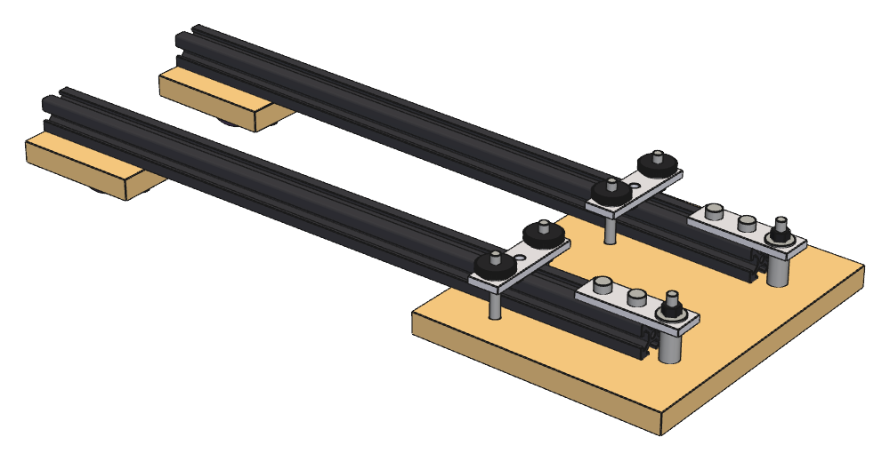
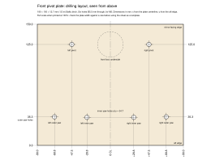

## 4. Tabletop optical frame

  
   
  <em>Fig. 1. Tabletop frame: rails, front pivot plate with pivot lugs and yaw straps, and rear foot blocks</em>

The model is `src/schlieren/parts/frame.py`.

### 4.1 Rails

- IXGNIJ black-anodized metric 2020 extrusion, Amazon B08Y8N7FD1
- 20 × 20 × 400 mm
- two rails used
- nominal 6 mm European-style slot

There is no rear crossrail.

Measured slot geometry of the extrusion:

| Feature               | Measured value      |
|-----------------------|---------------------|
| Slot mouth width      | 0.258 in / 6.55 mm  |
| Internal cavity width | 0.436 in / 11.07 mm |
| Slot depth            | 0.254 in / 6.45 mm  |
| Lip thickness         | 0.065 in / 1.65 mm  |

These dimensions suit M5 hardware for 20-series / nominal slot-6 extrusion.  Ordinary attachments use M5 × 0.8
socket-head hardware with flat washers in standard metric lengths and the roll-in/drop-in M5 T-nuts (Amazon
B0DP6JBX4Y).

### 4.2 Front pivot plate

The front pivot plate is a 180 × 150 × 12.7 mm Baltic-birch rectangle with no structural cutouts. The 180 mm
dimension is transverse to the rails and the 150 mm dimension is fore/aft.

Plate coordinates are the pivot frame ([§3.4](01-context-and-layout.md#34-common-optical-axis-datum)): the
origin is at the midpoint of the aft edge, +y runs toward the mirror along the plate centerline, and +x runs to
the right seen from above with the mirror ahead. The mirror-facing edge is at y = 150 mm, and the left rail is
the one at negative x. The pivot line is 25 mm behind the mirror-facing edge, giving pivot centers at:

- left pivot: (-47.50, 125.00) mm;
- right pivot: (+47.50, 125.00) mm;
- total pivot separation: 95 mm.

The nominal rail half-angle implied by the 95 mm pivot separation and approximately 3.2 m mirror distance is
about 0.850°, or about 1.70° total chief-ray separation.

Each yaw-clamp station is 90 mm aft of its pivot along the nominal rail axis, giving yaw-strap centers at
approximately:

- left strap center: (-48.84, 35.01) mm;
- right strap center: (+48.84, 35.01) mm.

Each fixed yaw strap is perpendicular to its rail at the nominal rail angle. The two outer holes of each
3-hole joining plate give fixed yaw-bolt centers at approximately:

- left outer: (-68.83, 35.31) mm;
- left inner: (-28.84, 34.71) mm;
- right inner: (+28.84, 34.71) mm;
- right outer: (+68.83, 35.31) mm.

  
   
  <em>Fig. 2. Front pivot plate drilling layout, seen from above, in plate coordinates</em>

The four fixed yaw bolts pass through approximately 5.5 mm round clearance holes; the plywood is not slotted.
The straps stay fixed to the pivot plate while the 20 mm rails rotate beneath them. With 40 mm yaw-bolt
spacing, the rail has approximately 7.5 mm nominal edge-to-M5-shank clearance per side and retains about
2.8 mm clearance at ±3° rail yaw from nominal for the 90 mm pivot-to-clamp distance. Rail-to-bolt contact
does not occur until roughly ±4.7° from nominal, so the fixed-hole geometry provides ample adjustment range.

A front Sorbothane support foot is centered at approximately (0, 125) mm, directly between the two rail pivots,
keeping the support point on the pivot line and clear of the pivot and yaw hardware.

1/2 in Baltic-birch sheet stock is shared across the tabletop frame and mirror cell: it supplies the front
pivot plate, the two rear rail-support/foot blocks, the mirror-cell cell-adjuster plate, and the mirror-cell
base plate.

### 4.3 Pivot and yaw hardware

Pivot and yaw hardware use commercially available 2020 three-hole joining plates:

- MOPFOL 2020 3-hole joining plate, Amazon B0G8DCS7VP
- approximately 60 × 18 × 4 mm
- 20 mm hole pitch
- four in all: two as pivot lugs and two as yaw straps.

#### Pivot stack

Per rail, from the bottom up:

socket head → oversized washer → plywood pivot plate → 20 mm spacer → 4 mm joining plate → oversized washer →
M5 nyloc

The socket heads are beneath the plywood and the nylocs on top, matching the yaw-lock screws.

Hardware:

- McMaster 92290A265, M5 × 50 partially threaded 316 SS socket-head screw
- McMaster 92871A091, 20 mm × 10 mm OD × 5.3 mm ID stainless spacer
- McMaster 91116A350, M5 oversized washer, 15 mm OD
- McMaster 93625A225, M5 nylon-insert locknut

The pivot screws pass through approximately 5.5 mm clearance holes in the plywood.

#### Yaw lock

One 3-hole joining plate spans transversely across each rail. The two outer holes are used, giving 40 mm fixed
bolt-center spacing. The strap is fixed to the plywood by two round-hole through-bolts, one on each side of
the rail; the rail itself rotates beneath the strap. The plywood has no slotted yaw holes.

Each yaw screw stack, from the bottom up:

socket head → oversized washer → plywood pivot plate → (alongside the rail) → 4 mm yaw strap → oversized
washer → M5 thumb nut

The thumb nuts are on top of the straps, where they are accessible with the frame standing on its feet.

A strip of McMaster 9852N37 adhesive-backed 1/32 in (0.79 mm) EPDM on the underside of each strap, where it
bears on the rail top, adds friction to the yaw lock. The strip spans the strap width and stays between the
bolt holes (about 30 mm long, clear of the holes at ±20 mm).

Each strap center is 90 mm aft of its rail pivot along the nominal rail axis, with the strap perpendicular to
the nominal rail direction ([§4.2](#42-front-pivot-plate)). Yaw is adjusted and locked at the front pivot
plate by loosening the two thumb nuts, rotating the rail beneath the fixed strap, and retightening. The
bolt/rail clearance supports at least approximately ±3° adjustment about nominal with useful remaining
clearance.

Hardware:

- McMaster 92290A265, M5 × 50 partially threaded 316 SS socket-head screws — same fastener as the rail pivots
- McMaster 91116A350 oversized M5 washers
- McMaster 92815A202 M5 low-profile knurled thumb nuts
- McMaster 9852N37 1/32 in EPDM friction strips, cut from the same sheet as the cassette clamp-bar pads

The yaw screws pass up alongside the 20 mm rail, not through it, and span the approximately 1/2 in (12.7 mm)
Baltic-birch pivot plate, the full 20 mm rail height, the EPDM strip, the 4 mm yaw strap, washers, and the
thumb-nut engagement. The M5 × 50 yaw-clamp screw deliberately reuses the pivot-screw part rather than
introducing a separate low-profile screw.

### 4.4 Rear support and feet

Each rail has a removable 75 × 50 × 12.7 mm (3 × 2 × 1/2 in nominal) Baltic-birch rear foot block, cut from
the same 1/2 in sheet stock used elsewhere in the frame and mirror cell. The 75 mm dimension runs along the
rail and the 20 mm rail is centered across the 50 mm block width.

Each block attaches to the rail bottom slot with two M5 socket-head screws, two flat washers under each head,
and roll-in/drop-in M5 T-nuts. The two screw holes lie on the rail centerline and are 50 mm apart, symmetrically placed about the
block center; with the 75 mm block length, each screw center is 12.5 mm from its nearest end. The screws are
M5 from the general M5 assortment, 20 mm long, through approximately 5.5 mm clearance holes in the plywood.

The two washers set the screw's depth in the slot. With two nominal 1.0 mm washers and the 12.7 mm block, a
20 mm screw enters the rail slot by about 5.3 mm, about 1.15 mm short of the 6.45 mm slot floor. A single
washer leaves only about 0.15 mm, so the screw bottoms before the block clamps if the plywood runs thin; a
16 mm screw reaches only about 0.65 mm past the slot lip, too little to engage the T-nut; no standard length
lies between.

Each rear-foot screw stack, from the bottom up:

socket head → two flat washers → plywood foot block → M5 T-nut in the rail bottom slot

A Sorbothane foot is centered on the underside of each block, directly beneath the rail centerline and midway
between the two attachment screws. The 1-1/4 in / 31.75 mm diameter foot therefore does not obscure either
attachment screw or washer, allowing the complete plywood/foot assembly to be removed from and reinstalled on
the rail without disturbing the Sorbothane foot.  The blocks and feet support the rear of each rail but do not
provide yaw lock.

The complete frame is therefore supported on the table/bench top at three points:

- one centered foot beneath the front pivot plate;
- one foot beneath each rear support block.

Feet: McMaster 8215K2, 1-1/4 in OD × 5/8 in high, 30 OO Sorbothane, with a stiffer McMaster 8215K6 (same size)
as an alternative depending on vibration isolation needs. Moderate static compression of the front foot is
acceptable; the resulting small overall pitch is corrected during optical alignment.
