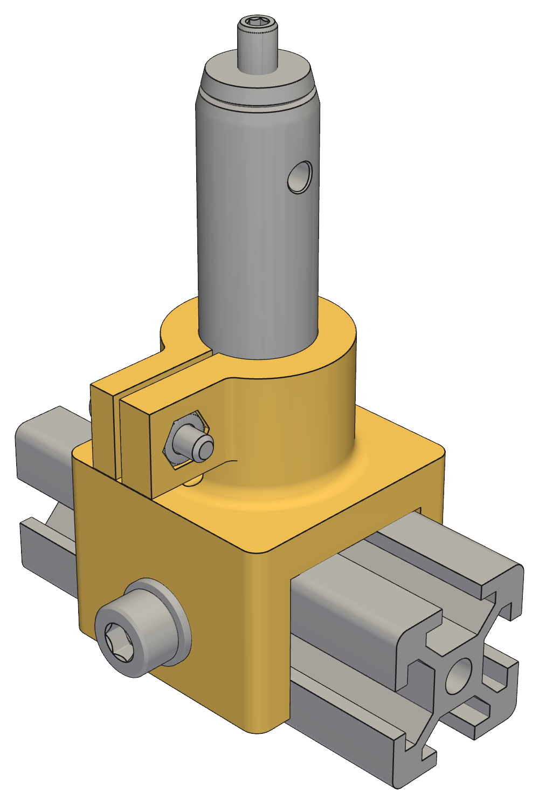

## 5. Common rail-mounted post support

Three fixtures use the common post/shoe architecture:

1. LED/condenser/iris;
2. source-slit flexure head (§7);
3. cutoff carriage (§8).

### 5.1 Post

- Thorlabs TR50/M
- 12.7 mm diameter
- 50 mm long
- quantity: 3, one at each common post/shoe station

### 5.2 Optical-holder allocation

- LED/condenser/iris: 1 × SMR1/M
- slit head: 1 × SM1RC/M, clamping the printed spigot of the slit-head adapter (§7.6)
- cutoff carriage: 1 × SM1RC/M, clamping the printed spigot of the carriage base plate (§8.1)

The condenser/slit/cutoff holders preserve the 22.1 mm post-top-to-axis dimension.

### 5.3 Common rail shoe

The common shoe is a printed ABS U-shaped saddle that:

- straddles the 2020 extrusion;
- locks through the rail side channels with M5 screws into the measured slot geometry (§4.1), using the
  20-series slot-6 T-nut hardware;
- leaves the rail top available as the datum surface;
- carries a vertical 12.7 mm through-bore for the TR50/M post.

The post passes through the printed shoe and bottoms on a McMaster 2895T62 0.010 in stainless datum disc
resting on the rail top. The printed ABS does not establish the precision optical height.

The post bore incorporates a single-split clamping collar so that the post can be locked against rotational
movement while remaining fully seated on the metal datum:

- one axial split;
- one transverse clamp screw;
- sufficient axial engagement to resist rocking and rotation;
- rounded stress-relief termination at the bottom of the split;
- generous fillets where the collar merges into the shoe body;
- free-fitting 12.7 mm post bore before clamping.

The clamp provides rotational and lateral retention; post height is still established solely by the post
bottoming on the metal datum disc. The model, with its fit-tested ABS allowances, is
`src/schlieren/parts/rail_shoe.py`.

  
   
  <em>Fig. 1. Common rail shoe on rail with TR50/M post</em>

#### Common printed split-clamp hardware

Every printed split clamp in the apparatus uses the same hardware:

M3 socket-head screw → clearance through one ear → captured M3 hex nut in the opposite ear.

- McMaster 91292A114 — M3 × 0.5 × 12 mm fully threaded 18-8 stainless socket-head screw; 5.5 mm head
  diameter, 3 mm head height, 2.5 mm hex drive. The same screw serves the carriage keeper frame
  ([§8.4](08-cutoff.md#84-cassette-seating)) and the slit head ([§7](07-source-slit.md#7-source-slit)).
- McMaster 91828A211 — full-height M3 × 0.5 18-8 stainless hex nut; 5.5 mm across flats × 2.4 mm high, DIN
  934. The same nut serves the keeper frame, the cassette clamp bars
  ([§8.7](08-cutoff.md#87-cassette-clamp-bars)), and the slit head.
- No washer, nyloc, or threaded insert.

Ear thickness and the approximately 1–2 mm relaxed split gap are designed around the 12 mm screw length.
