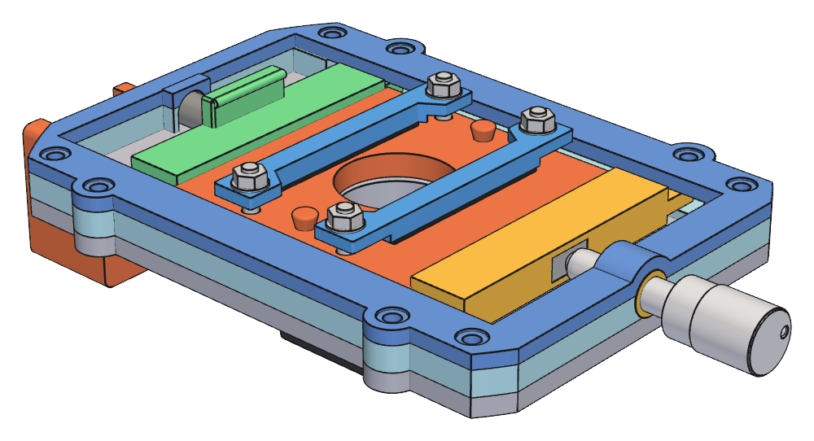
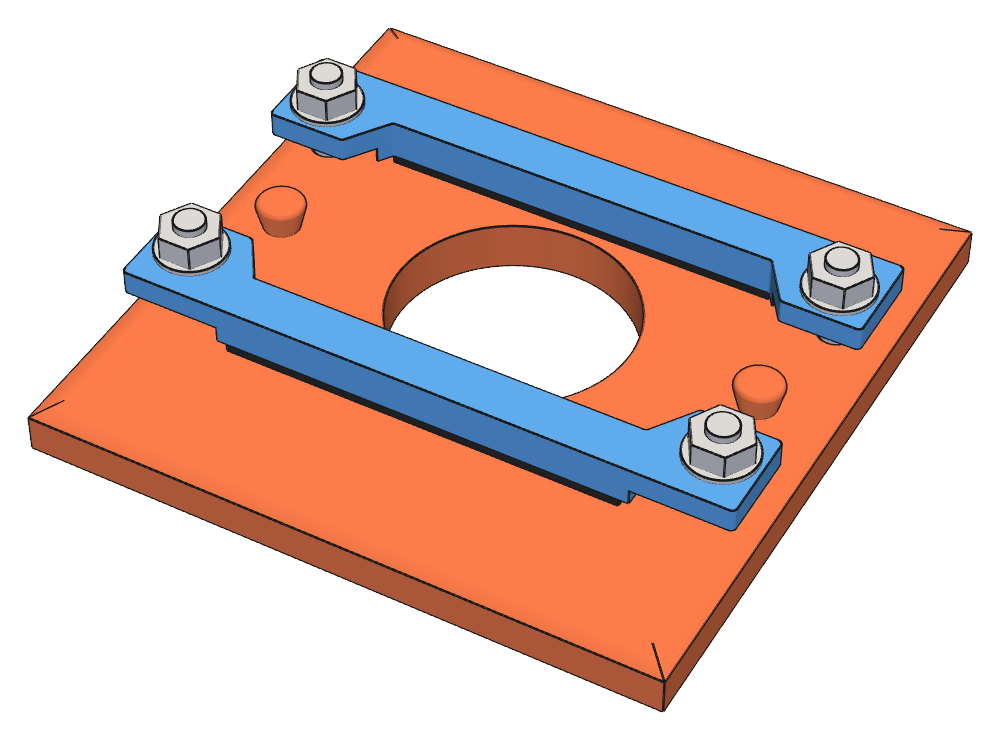

## 8. Cutoff

The cutoff sits at the returned slit-image plane on the imaging rail. It is a rotating carriage
([§8.1](#81-spigot-and-rotation-interface)–[8.5](#85-spring-seating-and-retraction)) holding interchangeable
64 mm cassettes ([§8.6](#86-common-cassette-standard)–[8.7](#87-cassette-clamp-bars)), which carry the cutoff
element: a knife edge, a fine wire ([§8.8](#88-fine-wire)), or a color filter
([§8.9](#89-color-filter-material)). The carriage model is `src/schlieren/parts/carriage.py`; the cassette
blank and clamp bars are modeled in `src/schlieren/parts/cassette.py`.

  
   
  <em>Fig. 8. Cutoff carriage with a seated cassette: guide frame, keeper plate, driven and spring plungers, and the FAS100 fine adjuster</em>

### 8.1 Spigot and rotation interface

The carriage mounts in 1 × Thorlabs SM1RC/M through a hollow printed spigot integral with the carriage base
plate, the same interface as the slit-head adapter
([§7.6](07-source-slit.md#76-rotation-mount-and-clearances)):

- Ø30.48 mm spigot (SM1 tube OD nominal), clamped directly by the SM1RC/M split ring (Ø30.7 mm bore, 10.16
  mm thick, M4 locking screw across the split); the spigot end is flush with the ring's rear face;
- Ø24 mm light bore through the spigot, matching the plate aperture;
- Ø34 mm shoulder as the ring's axial stop: the ring seats against it, which places the plate back 12.0 mm in
  front of the ring face. Do not clamp the ring away from the shoulder.

The 12.0 mm ring gap is set by the rail shoe, not the post. At nominal zero the plate reaches about 63.5 mm
below the optical axis, past the shoe top (about 52.4 mm below), so the plate back must clear the shoe end
(15 mm from the post axis): calculated clearance 2.1 mm to the shoe and 10.7 mm to the post body, at every
rotation. The shoulder clears the post top by 5.1 mm.

No SM1 tube, printed split clamp, retaining ring, or printed SM1 thread is used. The
SM1RC/M provides the rotational bearing and lock: when loosened, the carriage rotates on its spigot. Nothing
retains the spigot axially while the ring is loose, so support the carriage when rotating it.

Required carriage rotation:

- at least ±90°
- preferably ±100–120°

Define nominal zero as:

- cutoff line horizontal;
- fine-adjust translation vertical;
- fine adjuster pointing upward.

The cassette-loading side of the carriage faces the mirror, so cassettes are loaded and retracted from the
forward side, away from the telephoto. The spigot, slip ring, and post are therefore aft of the base plate; the
ring's rear face, 22.2 mm behind the plate back, is the rearmost part of the station on the optical axis and
is what the telephoto front must clear.

Fore/aft optical positioning is done by moving the rail shoe.

Rotation envelope: the 2020 rail runs beneath the carriage at every rail position, 72.35 mm below the axis.
The base plate, guide frame, and keeper are trimmed to a 70.35 mm radius about the optical axis (the rail top
less 2 mm clearance). Only the outer plate corners are removed; the plate is otherwise 86 mm wide, widened to
94 mm at the side keeper-screw lugs ([§8.4](#84-cassette-seating)). Calculated from the CAD, the carriage with
its FAS100 rotates clear of the rail over ±150°; only the FAS100 knob reaches the rail, near ±170–180°.
Nothing projects below the plate at nominal zero ([§8.5](#85-spring-seating-and-retraction)). **Provisional:**
clearance to other equipment on the rail near the cutoff station is not yet checked.

### 8.2 Spigot print and fit

The carriage base plate is printed deck down with the spigot up, so the spigot and shoulder need no
supports; the guide frame above the deck is a separate print (the base/frame split exists for this). The three
datum-pin shanks ([§8.4](#84-cassette-seating)) lie outside the shoulder and are flush-cut on the plate back.

**Provisional:** the spigot is printed at the SM1 tube nominal; fit-test it in the SM1RC/M and adjust if
needed.

### 8.3 Fine adjustment

The carriage uses:

- 1 × Thorlabs FAS100, 1/4 in-80 × 1.00 in
- 1 × McMaster 98625A950 brass 1/4 in-80 insert
- 1 × McMaster 2006N292 compression spring

Insert geometry is taken exactly from the McMaster-Carr 98625A950 drawing, not from a generic 1/4 in-80 insert
model. The drawing gives: internal
thread 1/4 in-80; body outside diameter 0.313 in (7.950 mm); overall axial length 0.313 in (7.950 mm);
under-flange/body length 0.298 in (7.569 mm); flange outside diameter 0.352 in (8.941 mm); flange thickness
0.010 in (0.254 mm); specified drill-bit size 0.313 in (7.950 mm); and minimum material thickness 0.298 in
(7.569 mm). The 0.352 in dimension is the flange OD, not the bore or insert-body OD.

The insert bore is nominally 0.313 in (7.950 mm), matching the drawing. The printed bore is a pilot, finished
after printing with a 5/16 in (0.3125 in) drill rather than relying on FDM accuracy; on the slit head this
gave a good press fit ([§7.7](07-source-slit.md#77-fabrication-and-fit)). The 8.5 mm insert support exceeds
the drawing's 0.298 in (7.569 mm) minimum material thickness, with about 3 mm of radial PLA around the insert
body. The flange is on the adjuster/outboard side, unrecessed, so the axial reaction from the FAS100 seats it
against the carriage.

FAS100 / insert travel envelope for CAD: the FAS100 uses a 1.000 in (25.4 mm) long 1/4 in-80 adjuster screw.
The 80 TPI pitch gives 0.0125 in (0.3175 mm) axial motion per revolution. Using the insert's 0.313 in overall
axial envelope as a conservative full-engagement allowance leaves approximately 0.687 in (17.45 mm) of
theoretical screw motion. That is a geometric clearance estimate, not a published FAS100 travel
specification. The carriage's working translation is ±5 mm / 10 mm total, leaving useful adjuster margin
before either end stop.

The FAS100 ball tip does not bear directly on printed PLA. The driven plunger carries a small hard bearing
insert made from a nickel-plated rectangular NdFeB magnet:

- Amazon B0DMCY4FN1
- N52 Bar Magnet - 10 mm L × 5 mm W × 2 mm H
- one magnet in the driven plunger

The magnet is used as a hard, wear-resistant plated bearing surface; its magnetic function is incidental. It
sits in a close-fitting printed pocket with its rear face fully supported by PLA, with a small CA or epoxy
tack for retention. The FAS100 ball contacts the broad plated face rather than bare PLA.

### 8.4 Cassette seating

Cassette motion is controlled by opposed plungers:

- fine adjuster on one side;
- spring-loaded plunger opposite;
- three fixed rear datum contacts on the carriage define the cassette optical plane;
- shallow cassette/plunger bevels generate axial seating force against the datum contacts.

The three rear datum contacts are McMaster 97936A109 brass escutcheon pins / decorative finishing nails, used
head-first as small domed sliding contacts. Each pin is approximately 3/8 in long, with a 0.050 in (1.27 mm)
smooth shank and 1/8 in (3.18 mm) domed head.

Mount each pin through a through-hole in the printed carriage with the domed brass head on the cassette side.
The holes are modeled Ø1.75 mm: the measured 0.050 in (1.27 mm) shank, plus the 0.38 mm diametral hole
undersize measured on the first base-plate print (the Ø24 mm aperture printed 0.930 in), plus 0.1 mm fit
clearance. If a shank binds, finish the hole with a #54 (0.055 in) drill. The hole fit only locates the shank; the head sets the datum. Seat the underside of the head firmly against the carriage datum face so datum height is
established mechanically rather than by adhesive thickness. Wick a small amount of CA around the shank from
the back for retention, then flush-cut and dress the projecting shank at the back of the carriage. Keep CA out
from beneath the head/contact surface.

The three pin heads form a broad triangular support pattern around the optical aperture. The cassette rear
face is the sliding datum surface and provides unobstructed swept tracks over the three domed
contacts throughout the fine-adjust travel. The pin coordinates, set in the carriage CAD, keep every datum
contact out of the swept track of the cassette's rear M3 clamp-screw countersinks over the full travel, so
the datum tracks stay on uninterrupted printed rear-face material at every cassette position.

The plunger bodies are constrained to the intended translation axis by ears/tabs riding in slotted guiding
rails. The guide slots prevent unwanted lateral movement or rotation while permitting the required axial
plunger travel.

The plungers need an assembly path into their guides: both longitudinal ends of the guide path are occupied,
by the FAS100 adjuster support on one side and the spring end wall on the other. The guide tracks are
therefore open from the cassette-loading side; the plungers drop into them, and a separate printed keeper
frame closes only the guide-ear regions.

The keeper is a perimeter frame, not a solid lid: the central upper aperture must remain open for cassette
insertion and removal. Its side members span the plunger guide tracks and retain the guide ears against upward
escape while the printed track walls carry the lateral guidance loads. The frame may be locally scalloped or
notched where the FAS100 adjuster axis intersects its envelope, provided the material directly over the swept
guide-ear paths and the load paths to the fasteners remain intact. The keeper's spring-end member also carries
the roof of the end-wall spring cup ([§8.5](#85-spring-seating-and-retraction)).

Keeper retention is mechanical, with eight fasteners per carriage. Each is the existing common McMaster
91292A114 M3 × 0.5 × 12 mm socket-head screw with a McMaster 91828A211 full-height M3 × 0.5 hex nut (5.5 mm
across flats × 2.4 mm high), captive in a hex pocket opening from the plate back. Screw heads and nuts bear
directly on the PLA, without washers; tighten only to a light snug, since the joint needs little clamp and a
firm hex-key torque can crush the bearing face.

- Four end screws, at (±38.5, −53) and (±38.5, +52) mm in the carriage frame (y along the travel, +y toward
  the FAS100). Each sits on solid fill closing its guide track from 1 mm beyond the outermost ear position
  to the plate end. The fill is also the plungers' end stop: 1 mm past full loading retraction for the spring
  plunger and past +5 mm travel for the driven plunger. These positions keep each nut pocket at least 1 mm
  inside the rotation envelope ([§8.1](#81-spigot-and-rotation-interface)).
- Four side screws, at (±42, ±37) mm, beside the middle of each plunger's ear travel. Each sits in a Ø10 mm
  round lug that widens the base, frame, and keeper locally to 94 mm, clipped at the guide-track wall.

The side screws carry the ear wedge reactions (below) into the frame close to where they arise. A first-order
beam estimate, with each keeper side member simply supported between adjacent screws, gives at most about
0.07 mm of upward keeper deflection at the ears at the maximum-compression load (with a PLA modulus of
about 3000 MPa assumed). That is within the 0.25 mm free play between the ears and the keeper; with only the
four end screws it would be about 1.5–2 mm. The keeper
side members are 3.0 mm thick. **Provisional:** if a print shows too much lift, a keeper with 5.0 mm side
members fits the same screws: its counterbores are deeper, so the head seat height is unchanged.

The screw heads sit in an approximately 0.5 mm-deep recess in the keeper, and the captive hex pockets are
approximately 2.5 mm deep. This leaves approximately 1.5 mm of PLA above each nut pocket and gives nearly
full use of the 12 mm screw length, with only slight nominal screw projection beyond the nut. The keeper seats on broad
printed lands, so the fasteners clamp it against the carriage rather than suspending it between isolated
points.

The vertical guide stack is: 4.0 mm carriage back plate; 2.0 mm rise from the plate front to the lower
guide-ear running surface; 3.0 mm plunger guide ears in a 3.4 mm guide channel; and a 3.0 mm keeper frame.

**Provisional:** the guide-stack dimensions, keeper recess and nut-pocket depths, sliding fits, and datum-pin
projection are first-print values, to be tuned from printed fit.

Use a very light film of plastic-safe lubricant on the PLA-on-PLA sliding interfaces, particularly the plunger
ears/tabs in their guide slots and any other plunger sliding faces. The lubricant is McMaster 1418K51
clear silicone grease, NLGI 1. Smooth/dress the printed sliding surfaces first, apply only a trace amount,
cycle the mechanism, and wipe away visible excess so the lubricant acts as a thin boundary film rather than a
grease-packed slide. Keep lubricant away from CA/epoxy/RTV bonding surfaces and apply it only after nearby
adhesive work is complete.

The plunger seating lips and the cassette edge bevels are 27.5° from the cassette plane, with a 1.25 mm
bevel depth.

For keeper-frame sizing, McMaster lists the 2006N292 spring rate as 0.14 lbf/mm. At the 9 mm fiducial
compression this corresponds to approximately 5.6 N of in-plane plunger force; at the 14 mm most-compressed
end of normal travel it is approximately 8.7 N. A frictionless first-order wedge model at 25–30° from the
cassette plane gives approximately 9.7–12.0 N upward reaction per plunger at fiducial and approximately
15.1–18.7 N per plunger at maximum normal compression. These reactions are carried upward through the plunger
ears into the keeper frame; about 20 N per plunger is the working-load scale before safety margin.

**Provisional:** the bevel angle and depth, and the seating-force estimate (which neglects sliding friction),
are pending a cassette insertion, seating, and tilt trial.

### 8.5 Spring seating and retraction

The spring plunger is preloaded by the McMaster 2006N292 compression spring ([§8.3](#83-fine-adjustment)),
acting between the frame's spring end wall and the plunger's outboard face on an axis 7.5 mm above the plate
back. No guide rod, retract handle, or penetration of the end wall is used; a guide rod through the end wall
would project below the axis past the rail top at nominal zero.

Each spring end sits in a printed cup, 3 mm deep, sized to the measured 0.272 in (6.91 mm) coil OD plus 1.0
mm diametral clearance:

- one cup extends inboard from the end wall: its side walls are on the guide frame, and its roof is carried
  by the keeper's spring-end member, so the keeper closes over the spring end when installed;
- one cup extends outboard from the spring plunger;
- both cups are open toward the plate deck, which carries the coil. Their side walls and roofs locate the
  coil ends laterally and against escape toward the cassette-loading side. Both print with legs on the bed
  and the roof bridging the coil, without supports.

The spring's free length is about 4–4.6 times its mean coil diameter, and both ends sit on parallel faces
because the plunger is guided. That is below the roughly 5.3 critical ratio for buckling with fixed ends,
so the cups need only locate the ends rather than guide the full length. The spring itself does not guide
the plunger; the slotted carriage guides constrain plunger translation and rotation.

The spring has a free length of approximately 25.5 mm. The carriage is designed around a 16.5 mm
spring length at the fiducial / mid-travel cassette position, corresponding to approximately 9 mm spring
compression from free length.

Normal supported plunger travel is ±5 mm about the fiducial position, for 10 mm total working travel. The
corresponding spring-length range is approximately:

- 21.5 mm at the least-compressed end of normal travel;
- 16.5 mm at fiducial / mid travel;
- 11.5 mm at the most-compressed end of normal travel.

Loading retraction is a further 6 mm from fiducial (10.5 mm spring length), leaving 4.5 mm between the cups.
Any additional compression capacity is treated as design margin rather than normal commanded travel.

Retraction for cassette loading uses a thumb tab on the spring plunger's front face at its outboard end:

- 20 mm wide × 3 mm thick × 6 mm tall, centered between the guide ears and outside the cassette footprint;
- the thumb reaches over the cassette and pushes the tab's inner face outboard, at about 9 N at full
  retraction;
- 0.5 mm chamfers on the exposed edges; the spring-facing face is left square;
- a Ø1.6 mm grip bead along the inner top edge, flush with the tab top, prevents finger slip.

The tab is kept low, close to the plane of the guide ears, so that pushing on it does not twist the plunger
and jam the ears.

### 8.6 Common cassette standard

Cassette envelope:

- 64 × 64 × 5 mm PLA
- 24 mm diameter central clear aperture
- identical shallow bevels on all four perimeter edges
- insertable at 0 / 90 / 180 / 270°
- perimeter kept clear enough to use any opposing edge pair
- orientation/polarity indicated by markings rather than a mechanical key.

Cassettes load with the spring plunger retracted 6 mm beyond fiducial
([§8.5](#85-spring-seating-and-retraction)).

Cassette variants, all built on the common blank:

1. single razor knife edge;
2. centered fine-wire or filament dark-field cutoff ([§8.8](#88-fine-wire));
3. striated / multicolor gel filter ([§8.9](#89-color-filter-material));
4. dark-center color filter ([§8.9](#89-color-filter-material)).

  
   
  <em>Fig. 9. Cassette blank with its two clamp bars and hardware</em>

The standard cassette blank carries one opposed pair of integral filament cleats on the front / non-datum
face, rather than making cleats a special cassette variant: two cleats, one on each side of the 24 mm optical
aperture, at (±25, 0) mm on an aperture centerline, outboard of the razor blades and clamp bars. The cleats
are slightly conical, Ø3.5 mm at the cassette face widening to Ø5 mm toward the top and rising 3 mm, so
filament tension drives fine wire or thread down against the cassette front face. The tops are rounded to
avoid damaging fine wire.
Route a filament in an S path, around opposite sides of the two cleats; the free span then crosses
approximately through the aperture centerline. Small angular error from finite cleat diameter or wrapping is
acceptable because the SM1RC/M rotates the complete tube/cassette assembly. This makes the same universal
cassette blank usable for blade, filter, Photofoil, wire, and thread experiments while keeping the rear datum
face unobstructed.

**Provisional:** cleat geometry is pending a wire-mounting trial.

### 8.7 Cassette clamp bars

These bars and their hardware are the clamping standard for the cassettes
([§8.6](#86-common-cassette-standard)); the slit head uses its own smaller bars
([§7.5](07-source-slit.md#75-blade-clamping)).

Common clamp bars:

- two identical printed rigid PLA bars fit each cassette;
- each bar uses two fasteners, one toward each end, so clamp force is distributed along the element;
- no holes are made through razor blades, filter material, or other optical elements;
- no blade-specific locating pocket or guide is required;
- McMaster 9852N37 adhesive-backed 1/32 in, 60A solid EPDM is applied to the removable clamp-bar face to
  provide compliance and friction;
- the bar bears primarily on the broad flat portion of a razor blade rather than relying on the folded
  spine for its clamp datum;
- the same clamp-bar geometry holds razor knife edges, Roscolux gel/filter material, Photofoil,
  and similar thin sheet cutoff elements.

Clamp-bar fastening is from the cassette rear/datum face toward the optical/front face so no screw ends or
nuts can protrude from the sliding/datum surface. Fasteners are positioned outside the optical-element
footprint where practical; the clamp bar spans and pinches the element against the cassette front face. At
each fastener, use:

flush M3 countersunk flat-head screw → 5 mm cassette body → printed clamp bar → M3 flat washer → ordinary M3
hex nut

The M3 flat-head screw is seated fully flush or very slightly below the rear cassette face and retained in its
countersink with a small CA tack using McMaster 1818A45 / Loctite 4061. The CA serves only to keep the screw
captive and resist rotation while the front-side nut is adjusted; it is not relied upon as the structural
clamp load path. The ordinary M3 nut remains exposed and accessible on the front of the clamp bar. Place the
washer between the nut and printed bar. Do not use prevailing-torque/nyloc nuts or threadlocker here.

#### Cassette clamp-bar hardware

| Component | McMaster part | Specification |
|---|---|---|
| Flat-head screw | [92125A133](https://www.mcmaster.com/92125A133/) | M3 × 0.5 × 14 mm, fully threaded 18-8 stainless, 90° countersunk head; 6 mm head diameter, 1.7 mm head height, 2 mm hex drive |
| Flat washer | [93475A210](https://www.mcmaster.com/93475A210/) | 18-8 stainless, 3.2 mm ID × 7 mm OD × 0.4–0.6 mm thick; DIN 125 / ISO 7089 |
| Ordinary full-height hex nut | [91828A211](https://www.mcmaster.com/91828A211/) | M3 × 0.5, 18-8 stainless, 5.5 mm across flats × 2.4 mm high; DIN 934 (the common split-clamp nut, [§5.3](05-post-support.md#53-common-rail-shoe)) |

The clamp bars are 4 mm printed PLA. The cassette blank has four Ø3.4 mm screw holes at (±27, ±12) mm with
rear-entry 90° countersinks matched to the 92125A133 head (Ø6.2 mm at the face: 6 mm head plus 0.2 mm
diametral allowance), and each bar end provides a washer bearing land at least 7.2 mm across. The screw head
finishes flush with or slightly below the rear/datum face so it cannot contact the carriage datum pins or
interfere with cassette sliding. The fasteners, bars, nuts, cleats, and projecting screw ends are clear of the
24 mm optical aperture and carriage interfaces. The holes and countersinks are features of the universal
cassette blank, not blade-specific geometry.

Because the clamp fasteners do not pass through the optical element, the screw length is not sized from a
blade-thickness stack. The 14 mm length gives full nut engagement and holds razor blades under the 4 mm bars,
with the head seated flush in its countersink. The screws are vertical and the lips act at the cassette edges,
so the screw length does not bear on the lips; the bar ends, which reach the bevel zone, are relieved to clear
them.

### 8.8 Fine wire

The dark-field filament set is enameled copper magnet wire in three readily available AWG sizes. The
nominal diameters below are bare-conductor diameters; enamel makes the finished optical obstruction slightly
larger.

| Wire size          | Nominal bare diameter | Approx. metric diameter | Experimental role                                          |
|--------------------|-----------------------|-------------------------|------------------------------------------------------------|
| 44 AWG magnet wire |             0.0020 in |               0.0508 mm | fine / high-sensitivity filament                           |
| 34 AWG magnet wire |             0.0063 in |                0.160 mm | intermediate filament, near the expected slit-image width  |
| 30 AWG magnet wire |             0.0100 in |                0.255 mm | coarse filament for stronger gradients / deeper dark field |

Exact finished outside diameter is not critical for the qualitative instrument.

The universal cassette cleat pair described in [§8.6](#86-common-cassette-standard)
is the quick-change mounting for these wires and for dark sewing thread or other fibers. Apply only
modest tension, particularly to 44 AWG wire; the conical cleats seat the filament against the cassette face,
and the S-wrap places the free span approximately on the aperture centerline.

### 8.9 Color-filter material

Filter material is cut from the Roscolux 3 × 6 in Designer Color Selector, which provides more useful
material per color than very small swatches.

For color schlieren:

- use the white Nichia LED;
- lock camera white balance;
- lock exposure.
