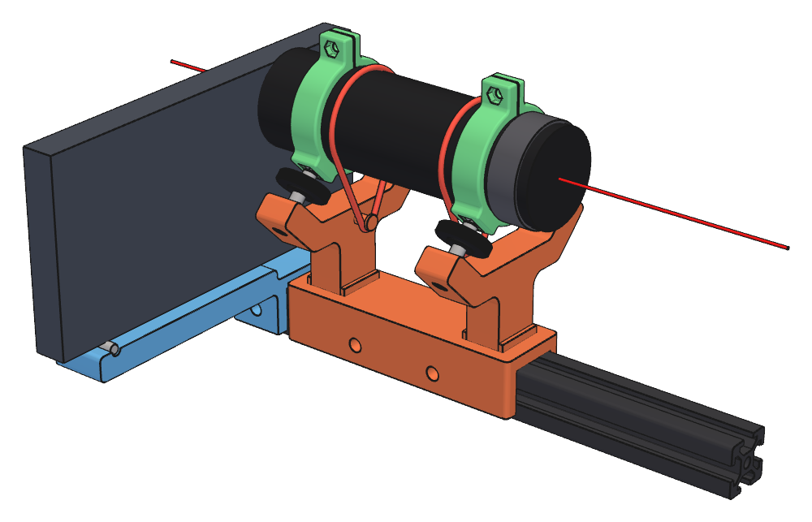

## 9. Camera and telephoto support

The camera and lens are chosen ([§9.1](#91-camera)–[9.2](#92-telephoto)). Their support is a lens pointer and a
phone rest ([§9.4](#94-support-concept)–[9.8](#98-retaining-bands)), with an alignment procedure
([§9.9](#99-lens-alignment)). **Provisional:** the phone rest's retainer and safety catch, the fit allowances of
the printed pointer parts, which are still to be tested, and the alignment procedure
([§11](11-open-work.md#11-provisional-areas-and-next-steps)).

### 9.1 Camera

- Apple iPhone 17, base model, in intended protective case
- held in landscape, with the rear cameras toward the mirror and the camera end of the phone toward the
  optical axis
- the Main camera is used, at 1× (or its 2× crop). It is the lower of the two rear apertures with the phone
  in portrait, "rear camera 2" on Apple's drawing (`docs/reference/Apple-iPhone-17.pdf`); the upper aperture
  is the Ultra Wide, used only at 0.5×
- measured camera optical axis approximately 60.6 mm above the lower long edge, in the case
- measured Main camera axis approximately 1.350 in / 34.3 mm from the near short edge, in the case; the case
  shape makes this hard to measure accurately with calipers

Manufacturer dimensions of the bare phone, from the drawing:

- both rear cameras are 13.62 mm from the nearer long edge, on a line parallel to it, so the measured axis
  height applies to either aperture
- the Main camera is 31.34 mm from the top short edge, 17.72 mm beyond the Ultra Wide at 13.62 mm
- body 149.61 × 71.45 × 7.95 mm; the camera glass stands 3.45 mm above the back glass

The drawing and the two measurements agree. The cameras are 57.83 mm from the farther long edge of the bare
phone, so the measured 60.6 mm implies a case wall of about 2.8 mm at that edge; the 31.34 mm and the measured
34.3 mm imply about 3.0 mm at the short edge (both calculated).

Initial recording modes:

- 4K/30 for normal work;
- 4K/60 for faster flow phenomena;
- SDR / HDR off as a stable starting point.

### 9.2 Telephoto

- iOgrapher proSnap 7×
- 17 mm mount
- approximately 37.0 mm diameter
- approximately 116.8 mm long
- measured mass approximately 215 g

Measured barrel sections, from the aft end forward:

| Section                 | Length              | Outside diameter    |
|-------------------------|---------------------|---------------------|
| aft end                 | 0.565 in / 14.4 mm  | not measured        |
| rear cylindrical barrel | 1.300 in / 33.0 mm  | 1.457 in / 37.01 mm |
| long cylindrical barrel | 2.25 in / 57.2 mm   | 1.459 in / 37.06 mm |
| focus ring              | 0.455 in / 11.6 mm  | not measured        |
| front lip               | 0.175 in / 4.4 mm   | not measured        |

Both cylindrical sections are suitable for clamping, giving about 90 mm of clampable barrel from 14.4 mm to
104.5 mm from the aft end. The focus ring must stay clear. The measured sections sum to 4.745 in / 120.5 mm,
about 3.7 mm more than the overall length listed above; the difference is not resolved.

The lens barrel, rather than the phone shell, is the preferred transverse optical datum because accurate lens
centering minimizes vignetting.

### 9.3 Alignment requirements

The returned slit image at the cutoff is the aperture stop for the camera: every ray from the test region
passes through it, then spreads again at the ±1.82° cone angle ([§3.2](01-context-and-layout.md#32-source-cone)).
The values below are calculated, and are **provisional** where they rest on assumed values: a lens front about
42 mm behind the cutoff plane, a 10 mm lit slit image, a Main-camera pupil of about 3.7 mm (6 mm focal length
at f/1.6), and a telephoto clear aperture near 30 mm.

| Quantity                                        | Value                    |
|-------------------------------------------------|--------------------------|
| Beam cone at the lens front                     | about 2.7 mm diameter    |
| Beam footprint at the lens front                | about 2.7 × 12.7 mm      |
| Slit image at the phone, reduced 7× by the lens | about 1.4 mm long        |
| Frame at 1×, 4K 16:9, through the lens          | about 9.9° × 6.1°        |
| Mirror in the frame                             | 3.6° of the 6.1° height  |

The resulting tolerances on the camera and lens as one body:

- centering on the beam: about ±8 mm along the slit direction and ±13 mm across it, before the reduced slit
  image leaves the phone pupil; the lens front aperture allows a similar margin;
- pitch: about ±1.2°, the spare frame height either side of the mirror;
- yaw: about ±3°.

Pointing is therefore the governing adjustment, and centering is forgiving. Image quality still favors
centering well inside the vignetting limit.

### 9.4 Support concept

The phone and the lens threaded onto its case are one rigid body. The lens barrel is its datum
([§9.2](#92-telephoto)): the lens is held at two stations along its barrel, and the phone hangs from its lens
mount. Two separate rail fixtures carry them:

- the lens pointer, specific to the lens, holds the barrel at both stations on four adjusting screws
  ([§9.5](#95-lens-pointer)) and is held down by two retaining bands ([§9.8](#98-retaining-bands));
- the phone rest, specific to the phone, supports the phone's lower edge at one point
  ([§9.6](#96-phone-rest)). A different phone needs only this part redesigned.

  
   
  <em>Fig. 9. Lens pointer and phone rest on the imaging rail, with phone and lens envelopes</em>

The body is located by six contacts and no more, so adjusting one station does not strain the lens mount:

- four screw tips, two at each station, fix the lens axis in x and z at both stations, and so its position,
  pitch, and yaw;
- one of those tips sits in a groove, fixing the lens fore/aft;
- the phone rest fixes roll.

Each station's pair of screws places one point of the lens axis, so the two stations give position and
pointing without coupling between them beyond the lever ratio. A second groove would fix the fore/aft position
a second time against the spacing of the collars on the lens, and would stop the pad sliding that yaw
adjustment needs. Holding the lens, not the phone, takes the lens weight off the lens mount: the mount carries
about 1 N in shear (calculated), against roughly 130–150 N·mm of bending if the lens were cantilevered from the
phone.

The model is `src/schlieren/parts/camera_support.py`. It holds the printed parts, with their fits, pockets,
fillets, and wall thicknesses, and checks contacts, clearances, and the lens and cord loads; the lens, phone,
and purchased hardware are envelopes or vendor models.

### 9.5 Lens pointer

The pointer is five printed parts and two bands. Two split collars clamp the barrel; two yokes carry the
adjusting screws; one shoe straddles the rail and carries both yokes.

#### Collars

Each collar is a thin ring on the barrel with a clamp ear on top and a flat pad platform at each screw:

- the aft collar on the rear cylindrical section, centered about 24 mm from the lens aft end, which leaves
  finger room for its thumb nuts ahead of the phone; the fore collar on the long cylindrical section, centered
  about 96.5 mm from the aft end, with its front face about 2 mm behind the focus ring; about 72.5 mm between
  them;
- 12 mm wide, with a 3 mm wall round a bore of 37.3 mm, the measured 37.0 mm barrel plus a 0.3 mm diametral
  allowance, so a collar is 43.3 mm across. The wall is thin because the pad platforms carry the local
  thickness; the pad loads are a few newtons, so stiffness is not limiting;
- the ear takes the common M3 split-clamp hardware ([§5.3](05-post-support.md#53-common-rail-shoe)) with the
  rail shoe's split and ear thicknesses: the screw passes through the thin ear on the left, and the hex nut is
  captured in a pocket in the thicker ear on the right, open to the outside, with a roof of at least 1.5 mm
  over it. The screw axis stands 4.25 mm above the ring top, so the screw head clears the ear's root fillet;
- inside corners, the ear and pad platform roots, are filleted at 2 mm for stress control; the other outside
  corners and the outer edges of both ring ends at 1 mm, for the fingers. The faces of the split stay sharp so
  that the gap stays fixed.

The two collars are the same part except that the aft collar's left pad is a rod seat in place of a magnet seat
(below).

#### Pads and pockets

Each screw tip bears on a flat pad on the collar, tangent to the ring at the screw: the pad face stands one
magnet thickness outside the ring, and the pocket floor is tangent to the ring's outside. Each pad sits in a
pocket with a rim round it, so a ball end that wanders reaches a wall instead of the edge of the pad:

- three pads are the 10 × 5 × 2 mm magnets, set with the 10 mm side across the rail, bonded into pockets
  0.1 mm larger per side;
- the fourth, at the aft left screw, is a groove between two dowel pins of 3 mm diameter and 10 mm length, lying
  across the rail on the pocket floor. The ball sits between them, free to slide across the rail but not along
  it;
- the rim stands 0.8 mm above the pad face. The ball-tip screw's end face is 1.2 mm behind the ball apex, so
  the rim stays below it;
- above the pad face the pocket opens outward by 0.23 mm per side, so that the rim edge stops the ball apex
  1 mm short of the pad edge, the margin the travel limits below assume. The walls round the pockets are
  1.5 mm.

The two screws of a station are at right angles, so advancing one slides the collar across the other's pad by
the same distance. Pad size, not screw travel, limits the adjustment. Calculated, keeping each ball 1 mm
inside the pad edges, which the rim enforces:

| Adjustment                           | Range                       |
|--------------------------------------|-----------------------------|
| Each screw                           | about ±3 mm                 |
| A station, in x or in z alone        | about ±4 mm                 |
| Lens tilt, pitch or yaw              | about ±2°                   |
| One turn of both screws of a station | about 1.1 mm, or about 0.9° |

The tilt limit comes from the 5 mm side of the pads, on the pads that slide along the rail as the lens yaws
about the groove. These ranges cover the alignment tolerances ([§9.3](#93-alignment-requirements)) and the
expected build errors.

#### Yokes

Each yoke is one printed part, 14 mm thick along the rail, in the shape of a T with an inclined arm either
side, printed on its side so that every layer lies in the plane of the loads:

- a column 20 mm wide, the width of the rail, rising from the shoe to a crossbar 10 mm thick whose top stands
  13 mm below the bottom of the collar, clear of the thumb nuts;
- each arm is a slab 10.5 mm thick, square to its screw. Its lens-side face carries the insert and runs down to
  the crossbar top; its back face runs down to the crossbar underside, so there is no stub or step;
- fillets of 5 mm at the column root, 4 mm where the arm blends into the crossbar, and 2 mm round the outer
  arm corners;
- each arm holds a heat-set insert ([§9.7](#97-adjuster-hardware)) in a 6.4 mm hole from the lens-side face
  with the flange recessed flush. The wall round each insert and its flange recess is at least 2.9 mm, and a
  5.5 mm bore carries on through the back of the arm for the screw and its hex key.

Under the adjuster reactions of about 8 N the crossbar root sees about 0.6 MPa and the arm tip moves about
0.01 mm (calculated, with an ABS modulus of about 2000 MPa assumed), so stiffness and strength are not
limiting; the fillets are margin.

#### Shoe and joint

The shoe's lower section is that of the common rail shoe ([§5.3](05-post-support.md#53-common-rail-shoe)): a
20.4 mm rail opening, 5 mm side walls, 18 mm skirts, a 5 mm deck, and 2 mm rounded outside corners. M5
clearance holes cross the skirts at rail mid-height for the side-slot screws, two of them 36 mm apart midway
between the collars. The shoe extends 9 mm beyond each collar face, so it is symmetric about the middle of the
two stations. Each yoke is bolted to the deck, so that it prints on its side and the shoe prints without
supports:

- one 90° countersunk M5 screw from the underside of the deck, on the rail centerline, with its head flush with
  the underside, into a heat-set insert in the column foot, with the insert's flange bearing on the deck;
- two straight walls on the deck across the rail, ahead of and behind the column, 1.6 mm thick and 3 mm high,
  with 0.2 mm clearance to the column faces. They locate the yoke along the rail and stop it twisting;
- the screw ends inside the insert with about 5 mm of engagement.

**Provisional:** the bore, pocket, and wall clearances of the printed parts are fit-test values; the magnet and
rod adhesive is not chosen; the fitting and removal sequence is set by the bands
([§9.8](#98-retaining-bands)).

### 9.6 Phone rest

The phone hangs from the lens with its body to the outboard side of the optical axis
([§3.4](01-context-and-layout.md#34-common-optical-axis-datum)). Its weight, centered about 43 mm from the
lens axis, would turn the lens in its collars. The phone rest stops that: the phone's lower long edge sits on
one dowel pin lying along the rail, about 100 mm outboard of the axis, on the arm of a short printed
shoe of its own. The shoe's lower section is that of the pointer shoe ([§9.5](#95-lens-pointer)), with a
single pair of M5 clearance holes for the side-slot screw.

- The shoe is 22 mm long and centered under the rod. The arm runs across the rail from the shoe's outboard
  wall to 8 mm beyond the rod, 10 mm deep and as long as the shoe. The rod lies half sunk in a half-round seat
  in its top, with 0.1 mm radial clearance, and is bonded.
- The part is printed on its side, like the yokes: it is one profile in the plane of the load, extruded along the
  rail, so every layer is that profile and the arm needs no bridge or support. Only the side-slot screw bores
  are horizontal. The shoe's vertical corners on the arm side are left sharp, where the arm joins the wall.
- The arm's inside corners are filleted against stress: 3 mm under the arm where it meets the shoe wall, the
  largest because it takes the bending, and 2 mm where the arm top steps up from the deck. The outside corners
  at the tip and the step are rounded 2 mm, and the seat edges 0.5 mm. The arm is kept 10 mm deep so that the
  root fillet stays at least 1 mm above the side-slot screw head on the outside of the skirt.

- With the measured 60.6 mm camera-axis height, the phone's lower edge is about 11.75 mm above the rail top.
- The rest carries about 0.8–0.9 N (calculated, same assumptions as the contact loads in
  [§9.8](#98-retaining-bands)). It matters to the pointer, because it keeps the fore pad load from falling
  toward zero.
- The rest is fixed. Raising or lowering the aft collar rolls the phone slightly about the lens axis, which
  does not matter; the phone is not gripped and slides on the rod.
- The rest holds no optical alignment, so its dimensions are not critical.
- Because the rod lies along the rail, the rest needs to be only roughly under the phone.

**Provisional:** a light retainer to keep the phone on the rod, and a loose safety catch against a knock, are
not yet designed.

### 9.7 Adjuster hardware

There are four adjusting screws, two under each collar. Each is a ball-tip set screw in a heat-set insert in
its yoke arm, with a thumb nut threadlocked mid-screw as a handwheel.

Hardware:

- McMaster 93339A252, M5 × 0.8 × 25 mm ball-tip set screws: alloy steel, 25.0 mm overall including the ball,
  2.5 mm hex socket, and a 3.0 mm ball (ball size from the vendor model, `cad/vendor/McMaster-93339A252.step`;
  drawing `docs/reference/McMaster-93339A252.gif`)
- McMaster 94459A797, M5 flanged heat-set inserts: 6.73 mm long overall, with a 7.92 mm flange 1.02 mm thick,
  a 7.11 mm knurled body, and a 6.32 mm pilot (drawing `docs/reference/McMaster-94459A797.gif`; vendor model
  `cad/vendor/McMaster-94459A797.step`). The drawing calls for a 6.40 mm hole and at least 6.48 mm of
  material. Each is set from the lens-side face of its arm, flange outward and recessed, so the screw's
  reaction presses it into its hole. Two more are set in the yoke feet for the joint screws
- McMaster 92125A208, M5 × 0.8 × 10 mm 18-8 stainless hex-drive flat head screws (90°, 10 mm head), two for the
  yoke joints ([§9.5](#95-lens-pointer))
- McMaster 92815A202, M5 thumb nuts used as threadlocked mid-screw handwheels
- Loctite 271, McMaster 91458A160
- heat-set installation tip 92160A327;
- Amazon B0DMCY4FN1, N52 Bar Magnet - 10 mm L × 5 mm W × 2 mm H, as hard plated bearing pads, one at each of
  three screws;
- McMaster 91585A351, Ø3 × 10 mm 18-8 stainless dowel pins (ISO 2338 m6, chamfered ends), two for the groove at
  the fourth screw;
- McMaster 91585A457, Ø4 × 20 mm 18-8 stainless dowel pin, for the phone rest rod;
- the common M3 split-clamp screw and nut ([§5.3](05-post-support.md#53-common-rail-shoe)), one pair per collar.

### 9.8 Retaining bands

The collars sit on their pads under gravity alone, so each pad pair is held down by an elastic band. The pairs
carry only the lens and phone weight, and the fore pair least of all: contact loads, calculated from the measured 215 g
lens with an assumed balance point 60–70 mm from the aft end and an assumed cased phone mass of 177–210 g,
are

- aft screw pair: about 2.2–2.7 N;
- fore screw pair: about 0.6–0.9 N. The phone hangs behind the aft collar, so its weight pivots the lens about
  the aft screws and unloads the fore pair, but it cannot lift it: the lens moment is the larger.

A downward push on the phone, such as a screen tap, lifts the fore end when it exceeds roughly 2.5 times the
fore pair's load, about 1.5–2.2 N unaided, and a sideways nudge unseats a pad when it exceeds the load on its
pair. The alloy-steel screw tips are attracted to the magnet pads, which adds some preload; it is not relied
upon until measured.

Each band is an endless O-ring, 2 mm in section, of oil-resistant 70A Buna-N with an inside diameter of about
40 mm, lying round the bare barrel beside its yoke on the side toward the other collar, 11.8 mm from the
collar's center. Its two legs run down inboard of the thumb nuts to a peg on the center of the yoke's
crossbar face. The peg has a 4 mm stem and a 6 mm lip; the ring lies on the stem under the lip.

- The band acts on the barrel, which the collar's clamp carries to the pads, exactly as it carries the lens
  weight. The ring needs no groove on the collar and settles into the plane through the peg.
- The legs are about 65° above horizontal, so 5 N of hold-down takes about 2.75 N in each leg. A ring of that
  size stretched about 19% pulls about 3 N (calculated, with a 70A rubber modulus of about 5 MPa assumed).
- Each band acts about 12 mm from its collar. With one band beside each yoke, between the collars, each pad
  pair receives the hold-down of 5 N in total from the two bands (calculated), about 4.2 N from its own band
  and about 0.8 N from the other. That raises the tap threshold at the fore end to roughly 14 N.
- The legs clear the thumb nuts by more than 5 mm, so the cord stays out of the way of the fingers.
- To fit, slide the rings over the focus ring onto the bare barrel before clamping the collars on; refitting
  one afterwards means stretching it round the other collar and its ear. A band stays on the lens when the lens
  is lifted out with the peg end unhooked.

**Provisional:** the ring size is chosen on an assumed modulus; the next larger inside diameter is the
alternative if the 40 mm ring is too tight.

### 9.9 Lens alignment

This is the alignment the pointer must make possible, kept here as a feasibility check on the adjusters; a
consolidated setup and alignment procedure comes later. **Provisional:** the procedure is untested, and its
targets assume that the printed shoe seats fully on the rail top and the collars seat on their barrel sections.

The tolerances ([§9.3](#93-alignment-requirements)) are loose compared with the adjuster resolution, so the
alignment is mechanical first and then finished through the camera, with no laser.

Each adjuster moves the lens axis along its own screw, so at one station, with the screws at ±45° and a thread
pitch of 0.8 mm (calculated):

- both screws turned the same way, n turns: z moves n × 1.13 mm;
- the two turned in opposite directions, n turns each: x moves n × 1.13 mm;
- one screw alone, one turn: x and z each move about 0.57 mm;
- pitch and yaw come from setting the two stations 72.5 mm apart differently; 1 mm of difference is about
  0.8°.

The sequence:

1. Fit both collars and the phone on the lens at their stations, set the four thumb nuts to equal exposed screw
   length (mid-travel), and note their positions. Put the pointer shoe on the rail with its clamp screws loose.
2. Slide the shoe along the rail to put the lens front at the planned gap from the slip ring's rear face, then
   snug the clamp screws. The groove at the aft left screw fixes the lens fore/aft on the pointer, so nothing
   later moves it.
3. Center the barrel at each collar mechanically, aft first, and re-measure the other collar after each
   change. Height: from the shoe deck, beside the yoke, up to the barrel top, whose target is
   72.35 + 18.5 − 5 = about 85.85 mm (the deck top is 5 mm above the rail top; the barrel diameters of 37.01 and
   37.06 mm differ by too little to matter). Lateral: with the shoe pressed to one side of the rail, taking up
   its 0.4 mm lateral play, from the shoe's outer wall to the barrel side, whose target is 18.5 − 15.2 = about
   3.3 mm. A ±0.5 mm error between the stations is about 0.4° of pitch or yaw, within tolerance.
4. Finish through the camera, because the phone camera may not lie on the barrel axis in its mount and case.
   With the source lit and the cutoff cleared, view the returned field at 1× and trim the aft screws in x and z
   until the vignetting at the corners is even; a turn of one screw is only about 0.6 mm, so turn in small
   steps. The mirror should sit centered in the frame, which sets pitch and yaw to within the spare 1.2°.
5. Check the roll: the phone rest rod should just touch the phone's lower edge without lifting it, a paper
   strip sliding between them with light drag. A case thickness different from the assumed 11 mm is taken up
   by shimming the rod seat.
6. Record the final thumb nut positions, so that refitting the lens needs only a check.

- Each station's range is only about ±4 mm, so a larger offset is taken up by moving the shoe on the rail, not
  with the screws.
- The aft thumb nuts must stay clear of the phone while they are turned; the model leaves finger room, to be
  checked on the real phone.
